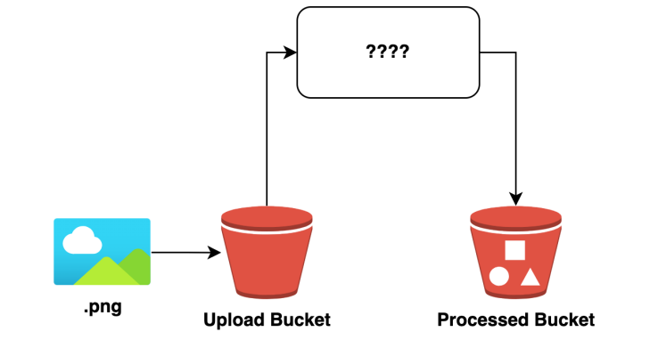

# lambda_challenge

The Challenge is in 2 parts.

Part1.

A user wants to upload a .png file and only a .png file into an s3 bucket. It must then be copied to the second bucket.
- There must be a role just for the uploading bucket 
- There must be a role just to pull from the second bucket
- No Role must not be able to upload directly into the second bucket

Part2.

The user wants the above image manipulated on copy.
  - The original image metadata must remain
  - The image must be resized to have a width of 500px
  
  
